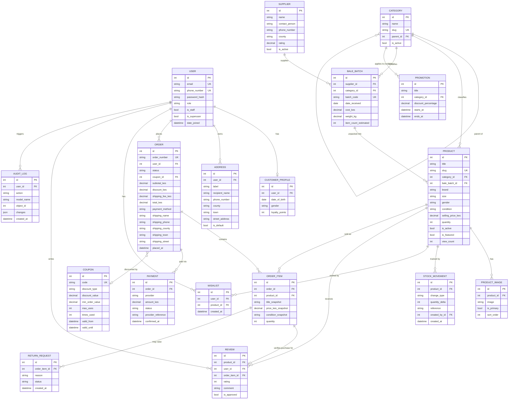

# ThriftHub KE — Phase 2: System Design

Builds directly on [`01-requirements-analysis.md`](./01-requirements-analysis.md).

## 1. Architecture Overview

```
┌───────────────────────┐        HTTPS/JSON         ┌────────────────────────────┐
│   React SPA (Vite)    │ ───────────────────────▶  │   Django REST API           │
│  - Router, Context    │ ◀───────────────────────  │  - JWT auth (SimpleJWT)     │
│  - Axios client        │      access token in       │  - Serializers/Views/       │
│  - Tailwind UI          │      Authorization header   │    Services/Permissions    │
└───────────────────────┘      refresh in httpOnly    └──────────────┬─────────────┘
                                 cookie                                │
                                                                        │ ORM
                                                          ┌─────────────▼─────────────┐
                                                          │       PostgreSQL           │
                                                          └────────────────────────────┘
                                                                        │
                                                          ┌─────────────▼─────────────┐
                                                          │  Media storage (Pillow-    │
                                                          │  processed; local dev,     │
                                                          │  S3-compatible in prod)    │
                                                          └────────────────────────────┘
```

**Style:** Layered monolith (not microservices) — appropriate for the actual scale of this
system. Each Django app owns one bounded context: `accounts`, `catalog`, `inventory`,
`orders`, `engagement`, `audit`, `core` (shared base classes/utilities).

**Backend layering inside each app:**
```
views (thin, DRF ViewSets/APIView)
  → serializers (validation + shape)
    → services (business logic: stock decrement, coupon validation, order totals)
      → models (persistence, DB constraints)
permissions.py (per-app, composable DRF permission classes)
```
Services exist specifically where business rules span more than one model (e.g. placing an
order touches `Product`, `StockMovement`, `Coupon`, `Order`, `OrderItem`, `Payment` inside one
atomic transaction) — that logic does not belong inline in a view or in a fat model method.

## 2. Backend Folder Structure

```
backend/
├── config/                      # Django project (settings, root urls, wsgi/asgi)
│   ├── settings/
│   │   ├── base.py
│   │   ├── dev.py
│   │   └── prod.py
│   ├── urls.py
│   └── wsgi.py
├── apps/
│   ├── core/                     # BaseModel (timestamps), pagination, exceptions, storages
│   ├── accounts/                 # User, CustomerProfile, Address + auth views
│   ├── catalog/                  # Category, Supplier, BaleBatch, Product, ProductImage
│   ├── inventory/                # StockMovement, low-stock alert logic
│   ├── orders/                   # Order, OrderItem, Payment, Coupon, Promotion, ReturnRequest
│   ├── engagement/                # Wishlist, Review
│   ├── audit/                    # AuditLog + signal receivers
│   └── analytics/                # Read-only aggregation endpoints for admin dashboard
├── payments/                      # Provider-agnostic payment interface
│   ├── base.py                    # PaymentProvider ABC
│   ├── mock_provider.py           # Dev/test provider
│   └── mpesa_provider.py          # Daraja adapter (wired via env flag)
├── manage.py
├── requirements/
│   ├── base.txt
│   ├── dev.txt
│   └── prod.txt
└── tests/ (mirrors apps/ per-app `tests.py` / `tests/` packages)
```

## 3. Frontend Folder Structure

```
frontend/
├── src/
│   ├── api/                      # Axios instance + one module per resource (products.js, orders.js...)
│   ├── auth/                     # AuthContext, ProtectedRoute, useAuth hook
│   ├── components/
│   │   ├── ui/                   # Button, Input, Card, Badge, Modal, Pagination... (dumb, reusable)
│   │   └── layout/                # Navbar, Footer, AdminSidebar
│   ├── features/
│   │   ├── shop/                  # ProductCard, ProductGrid, Filters, SearchBar
│   │   ├── cart/
│   │   ├── checkout/
│   │   ├── wishlist/
│   │   ├── reviews/
│   │   └── admin/                 # inventory, suppliers, analytics dashboards
│   ├── pages/                     # One file per route, composes features/components
│   ├── context/                   # CartContext (guest+user cart)
│   ├── hooks/
│   ├── utils/                     # formatCurrency (KES), validators
│   └── routes.jsx
├── index.html
└── vite.config.js
```

## 4. Database Design

### 4.1 Entity List (normalized to 3NF)

`User, CustomerProfile, Address, Category, Supplier, BaleBatch, Product, ProductImage,
StockMovement, Wishlist, Review, Coupon, Promotion, Order, OrderItem, Payment,
ReturnRequest, AuditLog`

Key normalization decisions:
- `Order` stores a **shipping-address snapshot** (name/phone/county/town/street) as plain
  fields rather than an FK to `Address`, so editing/deleting a saved address never rewrites
  order history.
- `OrderItem` stores **title/price/condition snapshots** at time of purchase, independent of
  the live `Product` row — required since prices and even product descriptions can change
  after an order ships, and refunds/analytics must reflect what was actually sold.
- `StockMovement` is an append-only ledger; `Product.quantity` is a denormalized current
  total kept in sync by the ledger writes inside a transaction — gives both fast reads
  (`quantity` column) and a full audit trail (the ledger), rather than computing `SUM()` on
  every page load.

### 4.2 ER Diagram



## 5. API Design (representative surface — full detail generated by DRF schema + Postman collection)

| Resource | Endpoint | Methods | Auth |
|---|---|---|---|
| Auth | `/api/auth/register/` | POST | Public |
| Auth | `/api/auth/login/` | POST | Public |
| Auth | `/api/auth/logout/` | POST | Authenticated |
| Auth | `/api/auth/token/refresh/` | POST | Cookie (refresh) |
| Auth | `/api/auth/password-reset/` `/password-reset/confirm/` | POST | Public |
| Accounts | `/api/accounts/me/` | GET/PATCH | Authenticated |
| Accounts | `/api/accounts/addresses/` | GET/POST/PATCH/DELETE | Authenticated |
| Catalog | `/api/catalog/categories/` | GET | Public |
| Catalog | `/api/catalog/products/` (`?search=&category=&size=&brand=&price_min=&price_max=&condition=&ordering=`) | GET | Public |
| Catalog | `/api/catalog/products/{slug}/` | GET | Public |
| Catalog | `/api/catalog/products/{slug}/related/` | GET | Public |
| Catalog (staff) | `/api/catalog/products/` `/api/catalog/products/{id}/` | POST/PATCH/DELETE | Staff |
| Catalog (staff) | `/api/catalog/suppliers/`, `/api/catalog/bale-batches/` | CRUD | Staff |
| Inventory (staff) | `/api/inventory/stock-movements/` | GET/POST | Staff |
| Inventory (staff) | `/api/inventory/low-stock/` | GET | Staff |
| Orders | `/api/orders/cart/checkout/` | POST | Authenticated |
| Orders | `/api/orders/` `/api/orders/{order_number}/` | GET | Authenticated |
| Orders (staff) | `/api/orders/{id}/status/` | PATCH | Staff |
| Orders | `/api/orders/coupons/validate/` | POST | Authenticated |
| Engagement | `/api/engagement/wishlist/` | GET/POST/DELETE | Authenticated |
| Engagement | `/api/engagement/reviews/` `/api/catalog/products/{slug}/reviews/` | GET/POST | Public read / Auth write |
| Analytics (staff) | `/api/analytics/sales/`, `/api/analytics/inventory/`, `/api/analytics/suppliers/` | GET | Staff |
| Audit (admin) | `/api/audit/logs/` | GET | Admin |

All list endpoints use DRF `PageNumberPagination` (default page size 20, `page_size` query
override capped at 100), `django-filter` `FilterSet`s, and `select_related`/
`prefetch_related` to avoid N+1 queries.

## 6. Authentication Flow

```
1. POST /api/auth/login/  { email, password }
     → validates credentials
     → issues: access token (JSON body, ~15 min expiry)
                refresh token (Set-Cookie: httpOnly, Secure, SameSite=Lax, ~7 day expiry)
2. Frontend stores access token in memory (AuthContext), attaches
     Authorization: Bearer <access> to every Axios request via interceptor.
3. On 401 (access expired):
     Axios response interceptor calls POST /api/auth/token/refresh/
     (browser sends the httpOnly cookie automatically) → new access token
     → original request retried transparently once.
4. POST /api/auth/logout/  → refresh token is blacklisted server-side (SimpleJWT
     blacklist app) and the cookie is cleared.
5. Password reset: POST /api/auth/password-reset/ {email} → emails a signed,
     time-limited token/link → POST /api/auth/password-reset/confirm/ {token, new_password}.
```
This avoids ever putting a long-lived token in `localStorage`, closing the most common JWT/XSS
weakness in naive React+JWT tutorials — a deliberate upgrade over the minimum spec.

## 7. Customer User Journey

```
Guest lands on Home → browses Shop/Category → filters/searches → views Product Detail
  → adds to Wishlist or Cart (both work for guests, held in localStorage)
  → proceeds to Checkout → prompted to Login/Register (cart merges into account)
  → selects/adds Address → applies Coupon (optional) → chooses Payment (M-Pesa/COD)
  → Order placed (stock locked/decremented atomically) → Order Confirmation page
  → tracks status in Order History → once `delivered`, can leave a Review
```

## 8. Admin / Staff Workflow

```
Add Supplier → Record incoming Bale Batch (cost, weight, category, item_count_estimated)
  → Unpack batch: create Products against that batch (title, images, price, condition, size)
    (each creation writes a `StockMovement(change_type=intake)`)
  → Products go live (is_active=True) → appear in Shop
  → Sale occurs → OrderItem created → StockMovement(change_type=sale, delta=-1)
    → Product.quantity hits 0 → is_active auto False
  → Staff dashboard surfaces Low Stock / Sold Out lists and Supplier performance
    (batches supplied, items listed, average sell-through, return rate)
  → Admin reviews Sales Analytics (revenue trend, top categories/products) and Audit Log
```

## 9. Key Architectural Decisions & Why

| Decision | Why |
|---|---|
| Django apps split by bounded context, not by "models.py in one app" | Keeps `orders` logic from leaking into `catalog`, matches how the team would divide future work |
| Service layer for cross-model operations | Checkout touches 5+ models atomically — that logic must live in one tested place, not duplicated across views |
| Snapshot fields on `Order`/`OrderItem` | Historical accuracy: an order must reflect what was actually charged/shipped even if the product or address changes later |
| `StockMovement` ledger + denormalized `Product.quantity` | Fast reads for the storefront, full auditability for inventory disputes — satisfies the "Inventory" and "Audit Logs" requirements from one consistent mechanism |
| Payment provider abstraction | No real Daraja credentials exist in this environment; the interface lets dev/test run fully offline while keeping prod integration a drop-in adapter |
| httpOnly refresh cookie + in-memory access token | Meaningfully more secure than the common localStorage-JWT pattern, at low added complexity |
| PostgreSQL + Django ORM only, no raw SQL | Removes SQL-injection surface by construction |

---
Next: Phase 3 (database implementation) begins with `backend/apps/*/models.py` matching the
ER diagram above.
